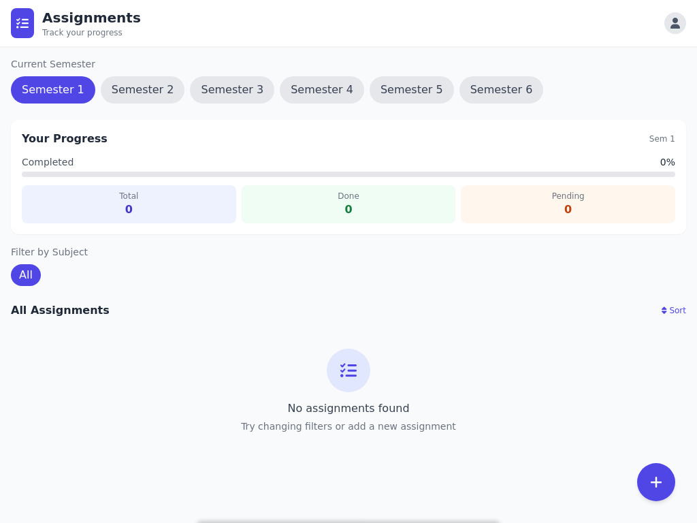

> **⚠️ Found a bug or issue?**  
> If you encounter or find any error, **do not hesitate to report it in the [Issues](../../issues) section**.  
> This helps me identify and fix problems more effectively. Thank you!


# **Assignment Manager**

A simple and elegant web-based **Assignment Tracker** built with PHP, MySQL, and TailwindCSS. Designed for college students to track, manage, and sort their assignments semester-wise with subject filters, priority tags, and progress analytics.


## 📸 Screenshot



---

## **Features**

- **Add**, **Delete**, and **Toggle** assignments
- Track **completion progress** per semester
- Filter by **subject**
- Sort by **due date**, **title**, **subject**, or **completion status**
- Add assignments with:
  - Title
  - Subject
  - Semester
  - Due date
  - Priority (High / Medium / Low)
  - Description
  - Completion status
- Responsive UI with **TailwindCSS** and custom animations
- Clean and minimal design with modal-based interactions

---

## **Technologies Used**

- PHP (Backend & API logic)
- MySQL (Database)
- TailwindCSS (Styling)
- JavaScript (Frontend interaction)
- FontAwesome (Icons)

---

## **Setup Instructions**

### 1. **Clone this repository**

```bash
git clone https://github.com/druvx13/assignment-manager.git
cd assignment-manager
```

### 2. **Import the SQL Database**

Import the `database.sql` file into your MySQL server:

```bash
mysql -u root -p < database.sql
```

Or use **phpMyAdmin** and import manually.

> Make sure your MySQL user credentials match the ones in `index.php`:
```php
$host = 'localhost';
$dbname = 'db_name';
$username = 'user_name';
$password = 'user_pass';
```

Update these values if needed.

### 3. **Run the Project Locally**

Place the project in your server directory (e.g., `htdocs` for XAMPP), then visit:

```
http://localhost/assignment-manager/index.php
```

---

## **Folder Structure**

```
assignment-manager/
├── index.php         # Main Application File
├── database.sql      # MySQL schema and seed data
├── README.md         # Documentation
├── LICENSE       # license
```

---

## **Database Schema**

You can find the full schema in `database.sql`. The main table is:

**assignments**
| Field       | Type         | Description                    |
|-------------|--------------|--------------------------------|
| id          | INT (PK)     | Unique ID                      |
| title       | VARCHAR      | Assignment title               |
| subject     | VARCHAR      | Subject name                   |
| semester    | INT          | Semester number (1-6)          |
| due_date    | DATE         | Due date (nullable)            |
| description | TEXT         | Optional description           |
| completed   | BOOLEAN      | Completion status              |
| priority    | ENUM         | `high`, `medium`, or `low`     |

---

## **Contributions**

Feel free to fork and submit pull requests. Feedback and suggestions are welcome!

---

## **License**

This project is licensed under the **GNU General Public License v3.0 (GPL-3.0)**.  
See the [LICENSE](./LICENSE) file for more details.

---
